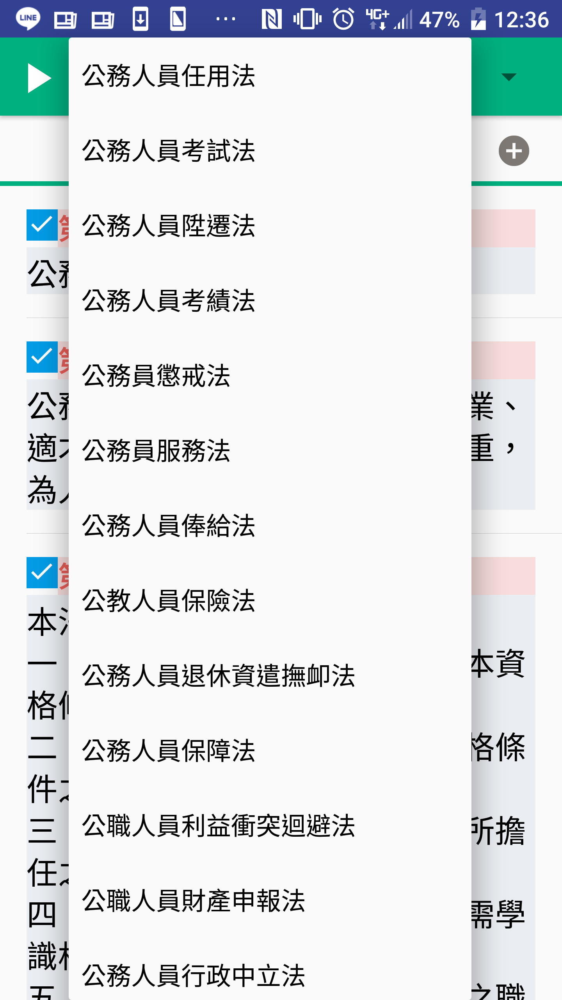
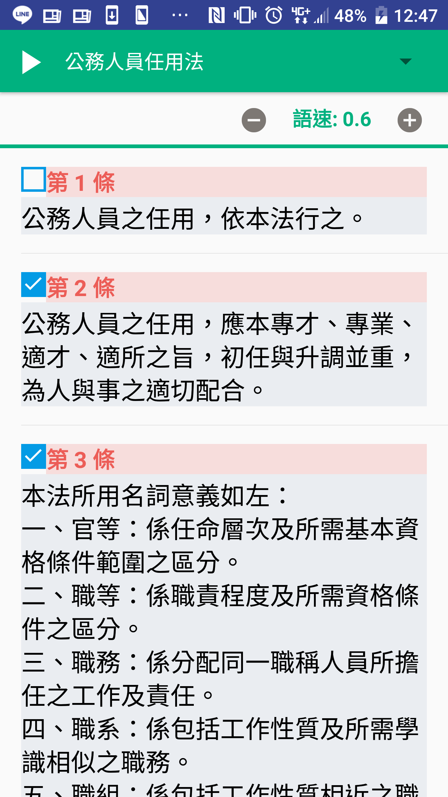

法律好好背APP
====================================

自動朗讀法條，用聽的來幫助考生記憶法條。

## 簡介
### 選單功能，包含最新修訂法條。

    

### 播放介面，可調整語速。

    

### 勾選重點法條，反覆背誦提升效果。

    

## 開發工具
- React Native
- Android SDK
- Node.js